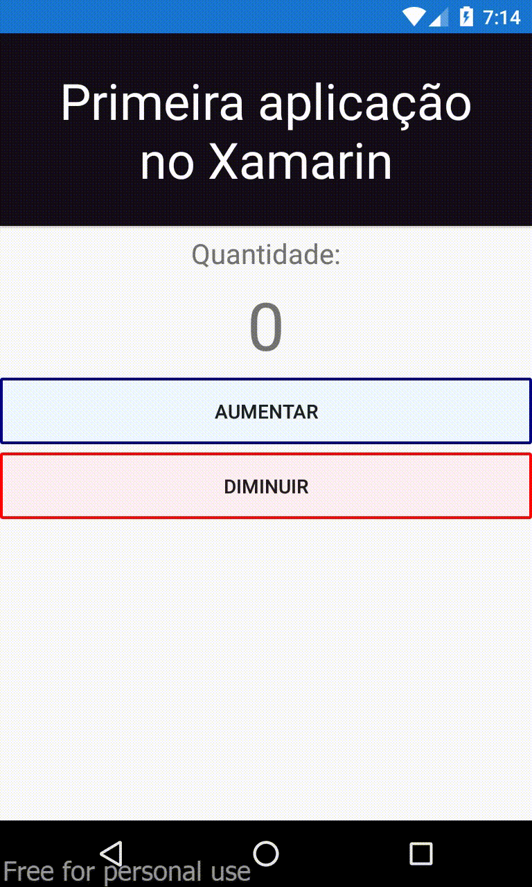

# Primeira aplicação desenvolvida utilizando o Xamarin

Aplicação construída para colocar em prática os primeiros conceitos a respeito da utilização do Xamarin Forms para construção de apps híbridos. 
A aplicação é um contador de clicks, onde o botão "Aumentar" incrementa o contador e o botão "Diminuir" faz com que o contador seja decrementado.

Abaixo é possível visualizar o app em funcionamento:
